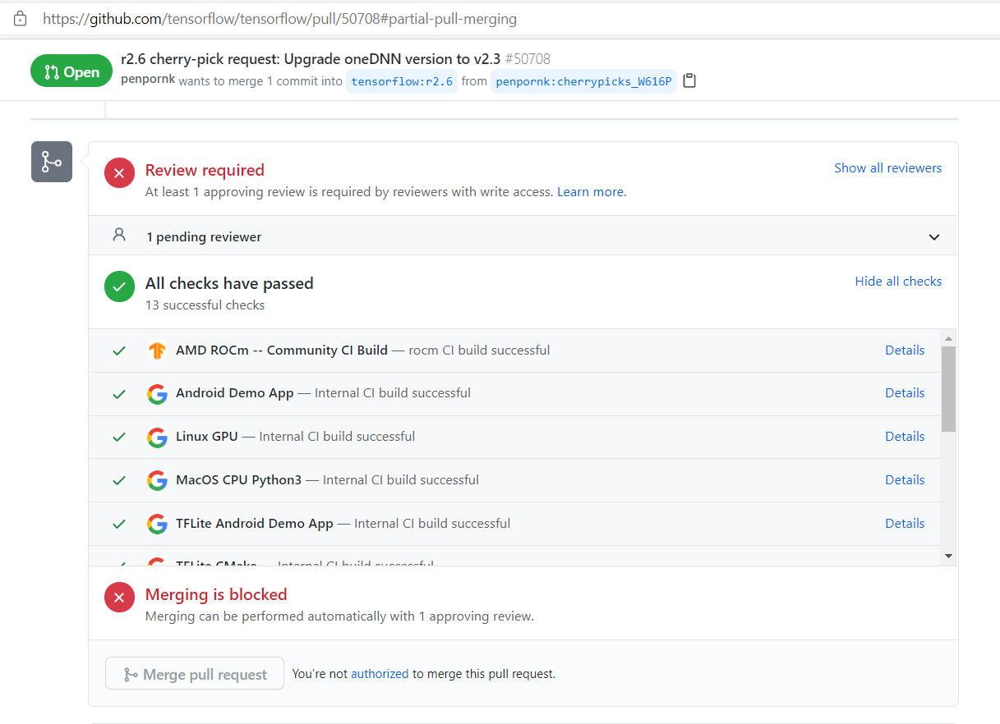
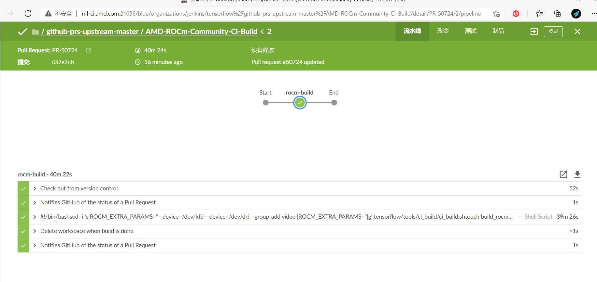
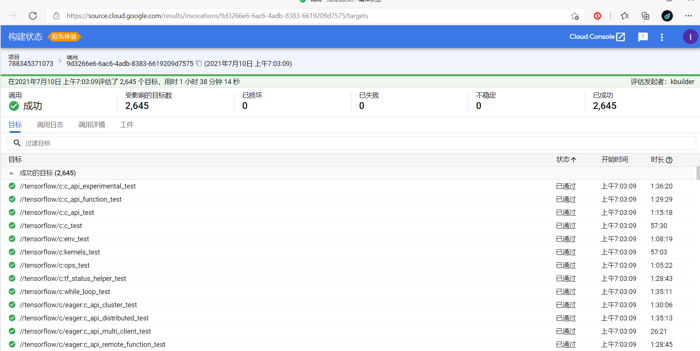
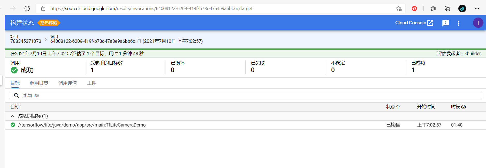

## 流程类

### 开发者参与流程调研
#### 拉取前需要检查的点包括：

- 阅读贡献指南
- 阅读行为准则
- 确保您已签署 贡献者许可协议 (CLA)
- 检查更改是否与指南一致 
- 代码风格一致
- 运行单元测试

#### 贡献者提交代码的流程：

##### 贡献者许可协议

填写个人或公司贡献者许可协议 (CLA)。如果您是编写原始源代码的个人并且您确定您拥有知识产权，那么您需要签署个人 CLA。如果您为一家允许您贡献工作的公司工作，那么您需要签署公司 CLA。按照上述两个链接之一访问相应的 CLA 以及有关如何签名和返回它的说明。一旦我们收到它，我们将能够接受您的拉取请求。

（注意：只有来自您和其他已签署 CLA 的人的原始源代码才能被接受到主存储库中。）

##### 贡献代码

如果您对 TensorFlow 有改进，请将您的拉取请求发送给我们！对于那些刚入门的人，Github 有一个 how to。

TensorFlow 团队成员将被指派审查您的拉取请求。拉取请求获得批准并通过持续集成检查后，TensorFlow 团队成员会将ready to pull标签应用于您的更改。这意味着我们正在努力将您的拉取请求提交到我们的内部存储库。在内部提交更改后，您的拉取请求将在 GitHub 上自动合并。

如果您想做出贡献，请开始使用 TensorFlow 代码库，导航到 Github“问题”选项卡并开始查看有趣的问题。如果您不确定从哪里开始，那么首先尝试这里较小/更容易的问题之一，即 带有“good first issue”标签的问题 ，然后查看 带有“contributions Welcome”标签的问题。这些是我们认为特别适合外部贡献的问题，通常是因为我们现在可能无法解决这些问题。如果您决定开始处理某个问题，请发表评论，以便其他人知道您正在处理该问题。如果您想提供帮助，但不是一个人，请使用问题评论线程进行协调。

##### 贡献指南和标准

在发送您的拉取请求以供 审核之前，请确保您的更改符合指南并遵循 TensorFlow 编码风格。

##### 贡献的一般准则和理念

- 在您贡献新功能时包括单元测试，因为它们有助于 a) 证明您的代码工作正常，以及 b) 防止未来的重大更改以降低维护成本。
- 错误修复通常也需要单元测试，因为错误的存在通常表明测试覆盖率不足。
- 当您更改核心 TensorFlow 中的代码时，请记住 API 兼容性，例如， tensorflow/core 和 tensorflow/python 中的代码。TensorFlow 已经通过了 1.0 版，因此在没有主要版本的情况下无法进行非向后兼容的 API 更改。您的拉取请求的审核者将按照 API 审核实践对任何 API 兼容性问题发表评论 。
- 当您向 TensorFlow 贡献新功能时，维护负担（默认情况下）会转移到 TensorFlow 团队。这意味着必须将贡献的收益与维护该功能的成本进行比较。
- 全新功能（例如，实现尖端算法的新操作）通常会存在于 tensorflow/addons 中，以便在决定是否将它们迁移到核心之前获得一些播放时间。
- 由于每个 PR 需要几个 CPU/GPU 小时的 CI 测试，我们不鼓励提交 PR 来修复一个错字、一个警告等。我们建议至少在文件级别修复相同的问题（例如：修复文件中的所有错别字，修复文件中的所有编译器警告等）
- 测试应遵循 测试最佳实践 指南。

##### 执照

在新文件的顶部包含许可证。

- C/C++ 许可证示例
- Python 许可证示例
- Java 许可证示例
- Go 许可证示例
- Bash 许可证示例
- HTML 许可证示例
- JavaScript/TypeScript 许可示例

Bazel BUILD 文件还需要包含一个许可部分，例如 BUILD example。

##### C++编码风格

对 TensorFlow C++ 代码的更改应符合 Google C++ 样式指南。

使用clang-tidy检查你的C / C ++的变化。要clang-tidy在 ubuntu:16.04 上安装，请执行以下操作：

`apt-get install -y clang-tidy`

您可以通过执行以下操作来检查 C/C++ 文件：

```
clang-format < my_cc_file > --style=google > /tmp/my_cc_file.cc
diff < my_cc_file > /tmp/my_cc_file.cc
```
##### Python编码风格

对 TensorFlow Python 代码的更改应符合 Google Python 风格指南

使用pylint来检查你的Python的变化。要根据 TensorFlow 的自定义样式定义安装pylint和检查文件pylint：

```
pip install pylint
pylint --rcfile=tensorflow/tools/ci_build/pylintrc myfile.py
```

注意 `pylint --rcfile=tensorflow/tools/ci_build/pylintrc`应该从顶级 tensorflow 目录运行。


- 其他语言的编码风格
- 谷歌 Java 风格指南
- 谷歌 JavaScript 风格指南
- Google Shell 风格指南
- Google Objective-C 风格指南

##### 运行健全性检查

如果您的系统上安装了 Docker，您可以通过运行以下命令对您的更改执行健全性检查：

`tensorflow/tools/ci_build/ci_build.sh CPU tensorflow/tools/ci_build/ci_sanity.sh`

这将捕获更改中可能存在的大多数许可证、Python 编码风格和 BUILD 文件问题。

##### 运行单元测试

有两种方法可以运行 TensorFlow 单元测试。

1. 使用直接安装在系统上的工具和库。

有关所需的包，请参阅 CPU-only 开发人员 Dockerfile 和 GPU 开发人员 Dockerfile。另外，使用上述 多克尔图像，例如， `tensorflow/tensorflow:devel`与`tensorflow/tensorflow:devel-gpu`发展，以避免直接在您的系统上安装的软件包（在这种情况下要记得更改目录从`/root`到`/tensorflow`一旦你进入运行的容器中，以便`bazel`能找到`tensorflow` 工作区）。

安装软件包后，您可以通过执行以下操作在 bazel 中运行特定的单元测试：

如果要在 GPU 上运行测试，请将 CUDA 路径添加到 LD_LIBRARY_PATH 并添加`cuda`选项标志

```
export LD_LIBRARY_PATH= “ ${LD_LIBRARY_PATH}：/usr/local/cuda/lib64：/usr/local/cuda/extras/CUPTI/lib64：$LD_LIBRARY_PATH ”
导出标志 = " --config=opt --config=cuda -k "
```

例如，要在 tensorflow/python 下运行所有​​测试，请执行以下操作：

`bazel测试 ${flags} //tensorflow/python/...`

对于单个组件，例如 softmax op：

```
bazel测试 ${flags} tensorflow/python/kernel_tests:softmax_op_test
使用Docker和 TensorFlow 的 CI 脚本。
```
2. 使用Docker和 TensorFlow 的 CI 脚本。


```
#首先安装 Docker，然后这将构建并运行 cpu 测试
tensorflow/tools/ci_build/ci_build.sh CPU bazel test //tensorflow/...
```
有关 详细信息，请参阅 TensorFlow 构建。


##### 为可测试的文档字符串运行 doctest

有两种方法可以在本地测试 docstring 中的代码：

1. 如果您只是更改类/函数/方法的文档字符串，则可以通过将该文件的路径传递给tf_doctest.py来测试它 。例如：

`python tf_doctest.py --file= <文件路径>`

这将使用您安装的 TensorFlow 版本运行它。确保您运行的代码与您正在测试的代码相同：

- 使用最新的tf-nightly pip install -U tf-nightly
- 将您的拉取请求重新设置为最近从TensorFlow 的主分支拉取 。

2. 如果您要更改类/函数/方法的代码和文档字符串，则需要 从 source 构建 TensorFlow。一旦您设置为从源代码构建，您就可以运行测试：

`bazel 运行 //tensorflow/tools/docs:tf_doctest`

或者

`bazel 运行 //tensorflow/tools/docs:tf_doctest --module=ops.array_ops`

的`--module`是相对于`tensorflow.python。`

##### 调试版本

在构建 Tensorflow 时，传递 `--config=dbg` 给 Bazel 将构建带有调试信息且没有优化的构建，允许您使用 GDB 或其他调试器来调试 C++ 代码。例如，您可以通过运行以下命令构建带有调试信息的 pip 包：

`bazel build --config=dbg //tensorflow/tools/pip_package:build_pip_package`

TensorFlow 内核和 TensorFlow 的依赖项仍然没有使用调试信息构建--config=dbg，因为如果调试信息过多，Linux 上就会出现问题（有关上下文，请参阅此 GitHub 问题）。如果要调试内核，可以-g使用 --per_file_coptbazel 选项编译特定文件。例如，如果要调试以 开头的文件中的身份操作，则identity_op可以运行

`bazel build --config=dbg --per_file_copt=+tensorflow/core/kernels/identity_op. * @-g //tensorflow/tools/pip_package:build_pip_package`

请注意，该`--config=dbg`选项不受官方支持。

### 项目CI/CD的流程调研

从GitHub仓库里的Pull Requests一栏可以看到tensorflow开源项目的所有拉取请求，而每个拉取请求所要合并的代码都会经过自动化测试流程的考验，比如在这个PR中，通过了所有共13轮的各个方面的代码检查，那么它就可以受到开发者的review并进行进一步merge。



那么在tensorflow项目中，这13轮checks可以归类为以下几种

- Jenkins
- 测试用例
- Android/Linux/MacOS/TFLite环境适配
- 编译测试

#### Jenkins

- `AMD ROCm -- Community CI Build`

采用了Jenkins这款自动集成工具搭建流水线任务，主要用于构建工作区和对PR状态的反馈



#### 测试用例

- `Linux GPU`
- `MacOS CPU Python3`
- `Ubuntu CPU`

包含大量（2000+）的测试用例，针对库中所有涉及到的接口函数。



#### Android/Linux/MacOS/TFLite环境适配

- `Android Demo App`
- `TFLite Android Demo App`
- `TFLite iOS Tests`
- `Ubuntu Sanity`
- `Windows Bazel`
- `Windows Bazel GPU`



测试的目标很少（个位数），主要是对不同平台下应用的兼容性进行测试。

#### 编译测试

- `TFLite CMake`
- `TFLite Makefile`

具体细节无从得知，但从测试名上看，应该属于代码编译层面

